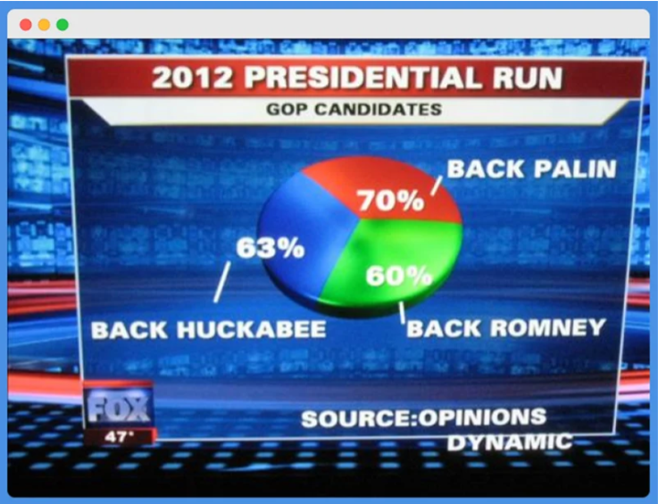
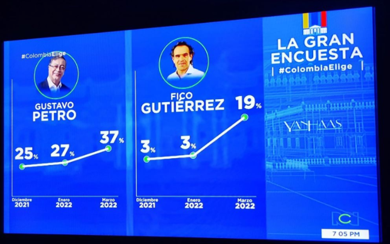
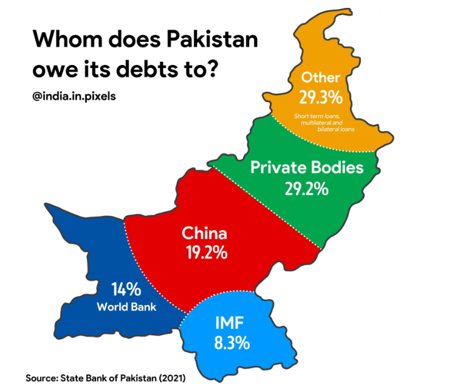

## Graphique 1

## Les pourcentages ne totalisent pas 100%, alors qu’un camembert doit représenter l’ensemble des données. Cela rend donc les proportions trompeuses. Il faudrait corriger les pourcentages afin qu’ils totalisent 100% ou utiliser un autre type de graphique 
## Source : https://rigorousthemes.com/blog/misleading-data-visualization-examples/

## Graphique 2

## Les deux graphiques utilisent des échelles différentes, ce qui fausse la comparaison. Par exemple, les 3% de Gutierrez apparaissent plus hauts que les 25% de Petro, alors que son score est en réalité beaucoup plus faible. Cela peut donc donner l’impression que Gutierrez est plus populaire. Il faudrait utiliser la même échelle verticale sur les deux graphiques
## Source : https://www.codeconquest.com/blog/12-bad-data-visualization-examples-explained/

## Graphique 3

## La taille des différentes zones ne correspond pas aux pourcentages indiqués. La part de la Chine paraît être la plus grande et la couleur rouge amplifie cet effet ce qui peut donner l’impression qu’elle est le principal prêteur du Pakistan. Il faudrait représenter chaque zone en fonction de son vrai pourcentage ou utiliser un graphique en barres pour mieux comparer les données
## Source : https://www.codeconquest.com/blog/12-bad-data-visualization-examples-explained/
