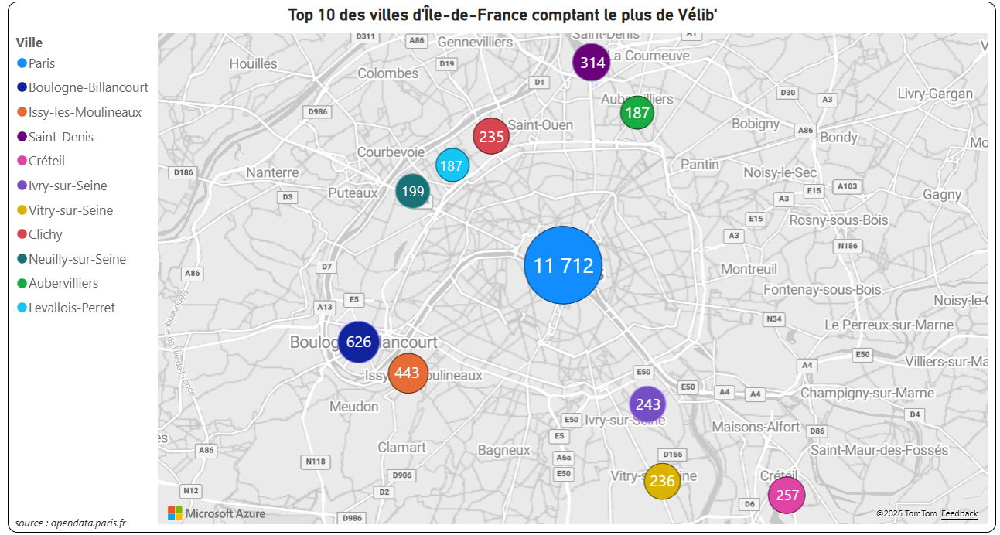
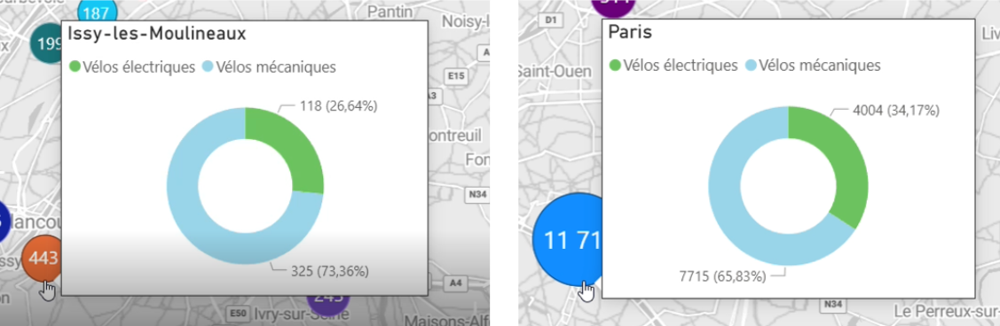
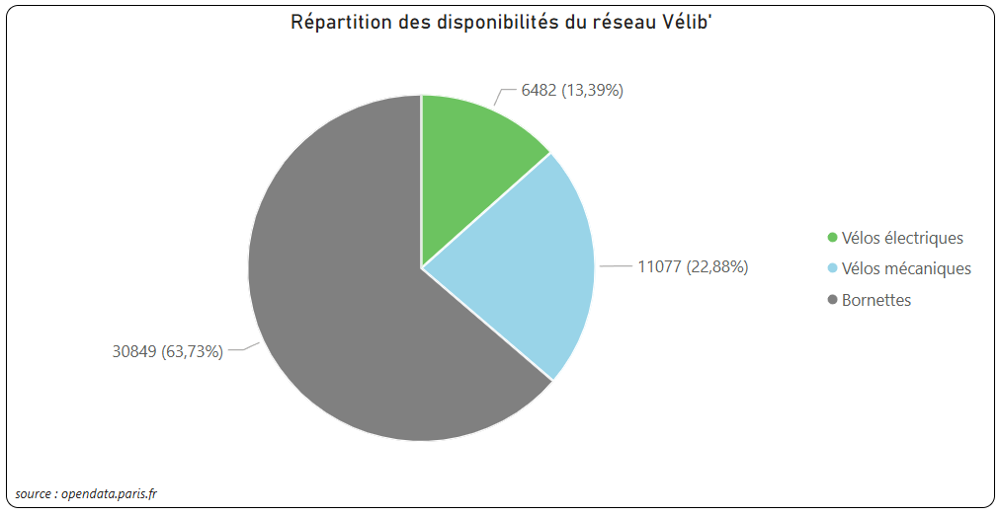

## Top 10 des villes d'Île-de-France avec le plus de vélos Vélib'

### Interprétation

La répartition des vélos Vélib' est très inégale entre les villes d'Île-de-France. Paris se distingue avec 11 712 vélos, soit un nombre largement supérieur à celui des autres communes. Boulogne-Billancourt arrive en deuxième position avec 626 vélos, suivie d’Issy-les-Moulineaux (443) et de Saint-Denis (314). À l'autre extrémité du classement, Vitry-sur-Seine compte 187 vélos. Ces résultats montrent que l'offre Vélib' est principalement concentrée à Paris, tandis que les autres villes disposent d'un nombre de vélos nettement plus faible.

### Fonctionnalité complémentaire

Une infobulle a également été ajoutée. En passant la souris sur une ville, l'utilisateur peut visualiser la répartition des vélos disponibles entre vélos mécaniques et vélos électriques grâce à un graphique en anneau intégré à l'infobulle. Cette infobulle s'appuie sur un titre dynamique créé à l'aide d'une mesure et d'un titre conditionnel (fx), permettant d'afficher automatiquement le nom de la ville sélectionnée.

---

## Répartition des disponibilités du réseau Vélib'

### Interprétation

Les bornettes représentent près des deux tiers des disponibilités du réseau Vélib' (63,73 %), avec 30 849 emplacements libres. Les vélos mécaniques constituent 22,88 % des disponibilités, soit 11 077 vélos, tandis que les vélos électriques représentent 13,39 %, avec 6 482 vélos disponibles. Cette répartition est cohérente avec le fonctionnement du réseau, qui doit conserver un nombre suffisant d'emplacements libres afin de permettre le dépôt des vélos dans les stations.

### Source

https://opendata.paris.fr/explore/dataset/velib-disponibilite-en-temps-reel/
